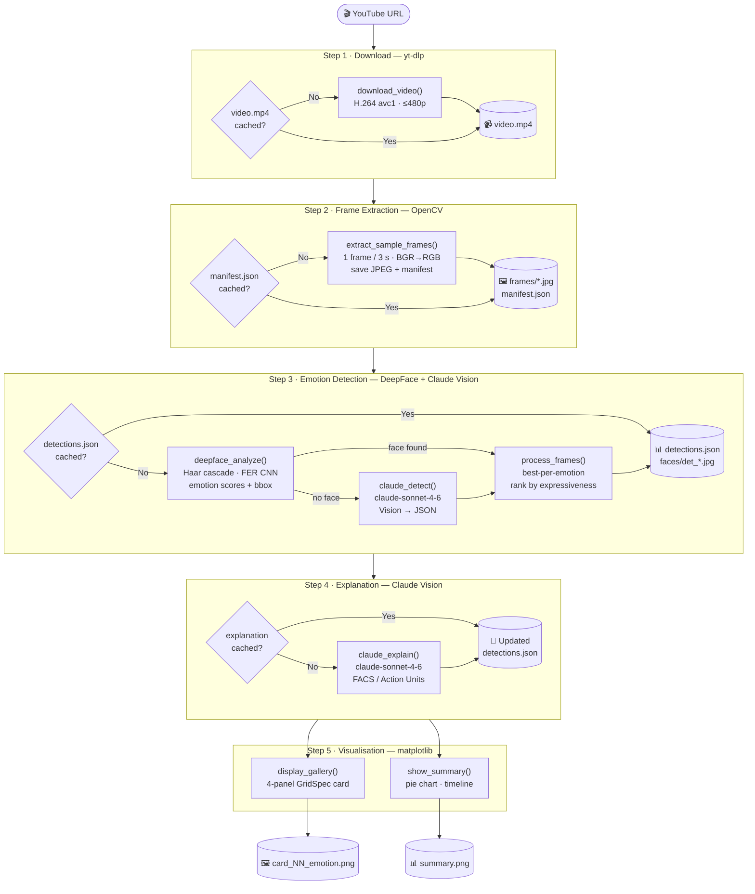

# 🎭 Video Emotion Analysis

Detect and explain human facial expressions in any YouTube video using a two-model pipeline: **DeepFace** (local CNN) for fast emotion classification and **Claude Vision** (LLM) for natural-language explanations grounded in facial muscle anatomy.

> **Current demo video:** ["Saving Private Ryan" wins Best Film Editing — 71st Oscars (1999)](https://www.youtube.com/watch?v=y1PruACVorM)

---

## Quick Start

```bash
# 1. Clone and enter the repo
git clone https://github.com/fborbon/image-analytics.git
cd image-analytics

# 2. Install dependencies
pip install yt-dlp opencv-python deepface tf-keras anthropic matplotlib pillow

# 3. Export your Anthropic API key
export ANTHROPIC_API_KEY="sk-ant-..."

# 4. Launch Jupyter and run all cells
jupyter notebook face_emotion_analysis.ipynb
```

All intermediate results (frames, detections, explanations) are cached to disk — subsequent runs are instant.

---

## Data Processing Pipeline

The notebook is structured as five sequential, independently-cached steps.

### Step 1 — Video Download (`download_video`)

`yt-dlp` fetches the target video from YouTube and saves it as `emotion_analysis/video.mp4`.

The format selector explicitly prefers **H.264 / AVC1** at ≤ 480p:

```
bestvideo[height<=480][vcodec^=avc][ext=mp4] + bestaudio[ext=m4a]
```

H.264 is required because OpenCV's `VideoCapture` cannot decode AV1 streams without hardware acceleration. If no AVC stream is available at ≤ 480p the fallback is format ID `18` — YouTube's legacy 360p H.264 + AAC single-file mux, which is universally available.

**Cache:** skipped automatically if `video.mp4` already exists and is > 100 KB.

---

### Step 2 — Frame Extraction (`extract_sample_frames`)

OpenCV reads the video and emits one frame every `SAMPLE_EVERY_N_SECONDS` seconds (default: 3 s).

Each selected frame is:
1. Color-converted from BGR (OpenCV native) to RGB (numpy/PIL convention).
2. Saved as a JPEG to `emotion_analysis/frames/frame_NNNNNN_tT.Ts.jpg`.
3. Appended to `emotion_analysis/frames/manifest.json` (frame index + timestamp + relative path).

For a 5-minute video at 3 s spacing this produces ~100 frames (~10 MB of JPEGs).

**Cache:** on re-run the function reads `manifest.json` and loads the JPEGs directly — the video is never opened again.

---

### Step 3 — Face Detection & Emotion Classification (`deepface_analyze` / `claude_detect` / `process_frames`)

For every sampled frame:

1. **DeepFace.analyze** attempts to locate faces and classify their emotion (see [Predictive Models](#predictive-models)).
2. If DeepFace finds no face (e.g., full-body shots, motion blur), **Claude Vision** (`claude_detect`) receives the centre-cropped frame and returns a JSON object with emotion scores and an initial explanation.
3. Each detection is scored by **expressiveness** = `1 − neutral_score / 100`. A purely neutral face scores 0; a strongly emotional one scores close to 1.

After all frames are processed, `process_frames` applies a two-pass selection:
- **Pass 1:** keep the single most-expressive detection for each of the 7 emotion classes.
- **Pass 2:** fill remaining slots (up to `MAX_RESULTS = 8`) with the highest-expressiveness detections not yet selected.

The final list is sorted chronologically by timestamp.

**Cache:** the selected detections (metadata + face crop JPEGs + full-frame JPEGs) are written to `detections.json` and `faces/det_NN_*.jpg`. On re-run the entire step is skipped.

---

### Step 4 — Explanation Generation (`claude_explain`)

For each selected detection Claude Vision receives:
- The **face crop** (base64-encoded JPEG, quality 85).
- A prompt specifying the detected emotion and its top-3 confidence scores, asking for a 2–3 sentence explanation citing **Facial Action Coding System (FACS)** muscle indicators (e.g., "zygomaticus major raises lip corners", "corrugator supercilii furrows the brow").

Explanations are written back into `detections.json`. If the notebook is interrupted mid-way only the missing explanations are fetched on the next run — the cache is updated incrementally.

---

### Step 5 — Visualisation (`display_gallery` / `show_summary`)

**Gallery (`display_gallery`):** one dark-themed 4-panel card per detection:

| Panel | Content |
|-------|---------|
| A | Full video frame with bounding box drawn in gold |
| B | Cropped and padded face with emotion label |
| C | Horizontal bar chart of all 7 emotion confidence scores |
| D | Claude Vision explanation text |

Each card is saved to `card_NN_emotion.png` (130 dpi). The face crop is also saved separately to `faces/face_NN_emotion.jpg`.

**Summary (`show_summary`):** a two-panel figure:
- **Pie chart** — distribution of the dominant emotion across selected moments.
- **Scatter plot** — timeline of detected emotions across the video duration.

Saved to `summary.png`.

---

## Architecture — Data Flow Diagram



---

## Libraries & Technologies

### `yt-dlp`
A fork of youtube-dl with active maintenance and support for 1 000+ sites. Used here purely for reliable, format-aware video downloading. The Python API (`YoutubeDL` class) lets you specify codec and container constraints programmatically, which is how we force H.264 output.

### `opencv-python` (cv2)
Open Source Computer Vision Library — the industry standard for image and video I/O and classical computer vision. Used for:
- **`VideoCapture`** — reads frames from the MP4 file at the native frame rate.
- **Color conversion** — `cv2.cvtColor(..., cv2.COLOR_BGR2RGB)` flips the channel order from OpenCV's default (BGR) to the RGB convention expected by every other library.
- **Bounding box annotation** — `cv2.rectangle` draws the gold face box on the gallery frame.
- **Haar cascade face detection** — invoked internally by DeepFace's `opencv` backend.

### `deepface`
A lightweight Python wrapper around several deep-learning face analysis models (TensorFlow/Keras backend). It packages face detection and attribute prediction into a single `DeepFace.analyze()` call. Used for:
- Locating faces in each frame (Haar cascade via `detector_backend="opencv"`).
- Classifying the detected face into one of 7 emotion classes.

See [Predictive Models](#predictive-models) for architecture details.

### `anthropic` (Anthropic Python SDK)
The official SDK for Anthropic's API. Provides the `Anthropic` client and structured message construction. Used to call **Claude Sonnet 4.6** (`claude-sonnet-4-6`) with multimodal (image + text) inputs in two roles:
- **Fallback detector** — when DeepFace finds no face, Claude receives the frame and returns a structured JSON with emotion scores.
- **Explanation generator** — receives the face crop and produces FACS-grounded natural language.

### `matplotlib`
Python's primary plotting library. Used for all visual output: the 4-panel gallery cards (via `GridSpec`) and the summary pie + scatter figure. The dark `#12121f` background and per-emotion color palette are applied through figure-level `facecolor` and axes `set_facecolor`.

### `Pillow` (PIL)
Python Imaging Library fork — handles image I/O between numpy arrays, JPEG files, and in-memory byte buffers. Used to:
- Save/load frame and face-crop JPEGs for the cache layer.
- Convert numpy arrays to JPEG bytes for base64-encoding before sending to the Claude API.

### `numpy`
Foundation of numerical computing in Python. Every image is a `numpy.ndarray` of shape `(H, W, 3)` (uint8 RGB). Used for array slicing (face crop with padding), shape introspection, and passing arrays between OpenCV, Pillow, and matplotlib.

---

## AI Technologies Explained

### Computer Vision — Image Classification

**What it is:** Computer vision is the field of enabling machines to interpret image data. *Image classification* assigns a label to an image (or image region). Here, the image region is a cropped face and the label is one of 7 emotions.

**How it is used here:** DeepFace runs a two-stage pipeline:
1. **Face detection** — a classical Haar cascade classifier (a sliding-window algorithm that detects Haar-like features: edge, line, and rectangle patterns that characterize a frontal face) localizes the face bounding box in the frame.
2. **Emotion classification** — the cropped face is passed through a Convolutional Neural Network that outputs a probability distribution over the 7 emotion classes.

### Generative AI — Large Language Models with Vision (Multimodal LLM)

**What it is:** A Large Language Model (LLM) is a transformer-based neural network trained on massive text corpora to understand and generate natural language. *Multimodal* LLMs extend this with the ability to process images alongside text. *Generative AI* refers to models that produce new content (text, images, etc.) rather than just classifying inputs.

**How it is used here:** Claude Sonnet 4.6 is a multimodal LLM. It receives a face-crop image encoded as base64 JPEG together with a text prompt. The model then:
- In `claude_detect()`: reasons about the image and generates a structured JSON with emotion scores — functioning as a zero-shot image classifier with uncertainty quantification.
- In `claude_explain()`: generates a 2–3 sentence description of which specific facial muscles and anatomical landmarks (FACS Action Units) it observes, and why they indicate the classified emotion. This is *generation*: the model produces new explanatory text grounded in visual evidence.

Unlike DeepFace, Claude does not need to be explicitly trained on emotion datasets — its visual reasoning capability emerges from the scale and diversity of its pre-training data.

---

## Predictive Models

### DeepFace Emotion Classifier

| Attribute | Value |
|-----------|-------|
| Library | `deepface 0.0.100` |
| Architecture | miniXception (lightweight depthwise-separable CNN) |
| Training dataset | FER-2013 (35 887 48×48 grayscale face images, 7 classes) |
| Output | Softmax probabilities × 100 → scores summing to ~100 |
| Classes | `angry · disgust · fear · happy · neutral · sad · surprise` |
| Face detector backend | OpenCV Haar cascade (`haarcascade_frontalface_default.xml`) |
| Input resolution | 48 × 48 px (internal resize by DeepFace) |

**Configuration in this project:**
```python
DeepFace.analyze(
    frame_rgb,
    actions=["emotion"],          # only run the emotion sub-model
    enforce_detection=True,       # return [] rather than guess if no face found
    detector_backend="opencv",    # fastest CPU-compatible backend
    silent=True,                  # suppress TensorFlow logs
)
```

**Why it was chosen:**
- **No GPU required** — runs on any laptop CPU via TensorFlow Lite.
- **Single install** — packages detection + classification in one call.
- **7-class output** matches the target emotion vocabulary exactly.
- **Speed** — ~100 ms per frame on CPU, suitable for batch processing ~100 frames.

**Main strengths:**
- The miniXception architecture is highly parameter-efficient (< 1 M parameters) while achieving competitive accuracy on FER-2013 (~65–66 % top-1).
- The Haar cascade detector is deterministic and extremely fast, requiring no neural inference for the detection stage.

**Limitation:** FER-2013 images are low-resolution (48 × 48 px) and lab-collected, so accuracy can degrade on natural, uncontrolled video frames. This is why Claude Vision is used as a fallback and for richer reasoning.

---

### Claude Sonnet 4.6 (`claude-sonnet-4-6`) — Anthropic

| Attribute | Value |
|-----------|-------|
| Type | Multimodal Large Language Model (Vision + Text) |
| Provider | Anthropic |
| Roles | Fallback emotion detector · Explanation generator |
| Model ID | `claude-sonnet-4-6` |

**Configuration in this project:**

| Function | `max_tokens` | Image quality | Task |
|----------|-------------|---------------|------|
| `claude_detect()` | 450 | JPEG 85 % | Return JSON: emotion + scores + initial explanation |
| `claude_explain()` | 300 | JPEG 85 % | Return plain text: FACS muscle-cue narrative |

Images are encoded as base64 JPEG (85 % quality) and sent inline in the API message. The 85 % quality setting balances detail retention against token cost — faces at this compression level retain enough micro-expression detail for reliable analysis.

**Why it was chosen:**
- **Zero-shot visual reasoning** — no fine-tuning on emotion datasets; the model generalizes from pre-training.
- **Structured output** — reliably returns valid JSON when prompted with an explicit schema, enabling deterministic downstream parsing.
- **FACS-aware explanations** — the model has internalized Facial Action Coding System knowledge from its training data, allowing it to cite specific muscles (e.g., "orbicularis oculi", "levator labii superioris") rather than vague descriptors.
- **Graceful degradation** — when DeepFace fails (no face detected, heavily occluded face, motion blur), Claude can still extract meaning from the scene.

---

## Caching System

Each expensive step writes its results to disk. The notebook checks for the cache at the start of each step and skips computation if it is present.

```
emotion_analysis/
├── video.mp4                    ← Step 1 cache (yt-dlp download)
├── frames/
│   ├── manifest.json            ← Step 2 cache index (timestamps + paths)
│   └── frame_NNNNNN_tT.Ts.jpg  ← sampled frames as JPEG
├── detections.json              ← Steps 3 + 4 cache (emotion scores + explanations)
├── faces/
│   ├── det_NN_face.jpg          ← cropped face per detection
│   └── det_NN_frame.jpg         ← full frame per detection
├── card_NN_emotion.png          ← Step 5 output: gallery cards
└── summary.png                  ← Step 5 output: summary dashboard
```

**To force a full rerun:**
```bash
rm emotion_analysis/frames/manifest.json   # re-extract frames from video
rm emotion_analysis/detections.json        # re-run detection + explanations
rm emotion_analysis/video.mp4              # re-download the video
```

**Partial reruns work automatically:** if the notebook is interrupted during Step 4 (explanation fetching), only the detections without an explanation are sent to Claude on the next run — the cache is updated incrementally.

---

## Configuration Reference

All tunable parameters live in the configuration cell (cell 4):

| Variable | Default | Effect |
|----------|---------|--------|
| `VIDEO_URL` | Oscar clip | YouTube URL to analyse |
| `SAMPLE_EVERY_N_SECONDS` | `3` | Temporal resolution of frame sampling |
| `MAX_RESULTS` | `8` | Maximum emotional moments shown in the gallery |
| `EMOTION_COLORS` | dict | Per-emotion hex color for charts and card borders |

---

## Output Files

| File | Description |
|------|-------------|
| `emotion_analysis/card_NN_emotion.png` | 4-panel gallery card: frame · face · scores · explanation |
| `emotion_analysis/summary.png` | Pie chart (distribution) + scatter plot (timeline) |
| `emotion_analysis/detections.json` | Machine-readable results: all metadata + explanations |
| `emotion_analysis/faces/face_NN_emotion.jpg` | Individual face crops |
